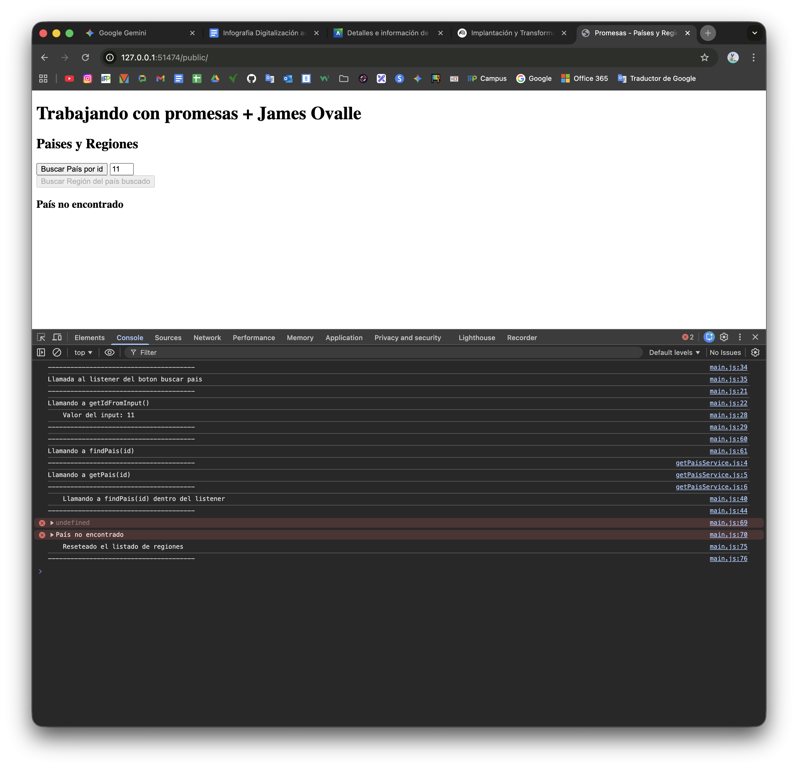
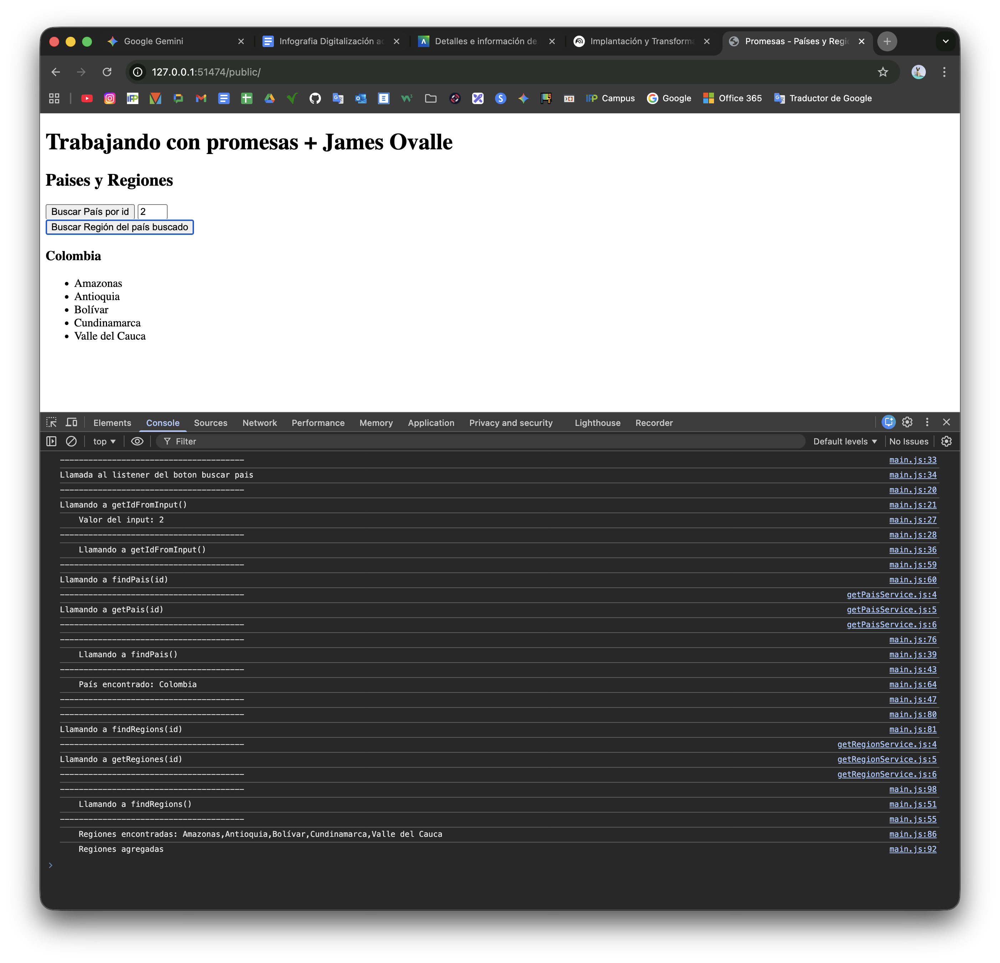
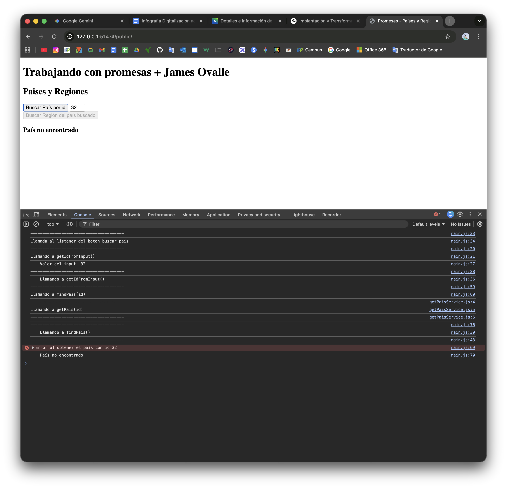
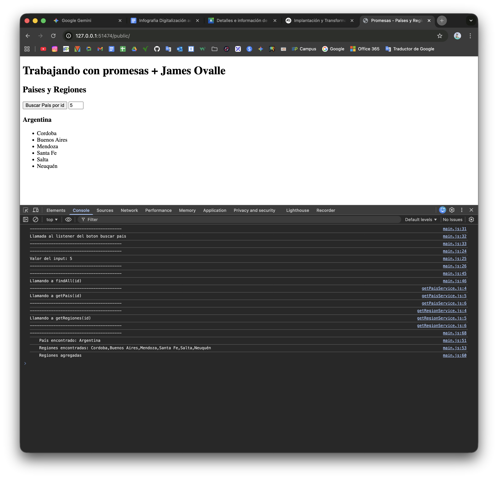
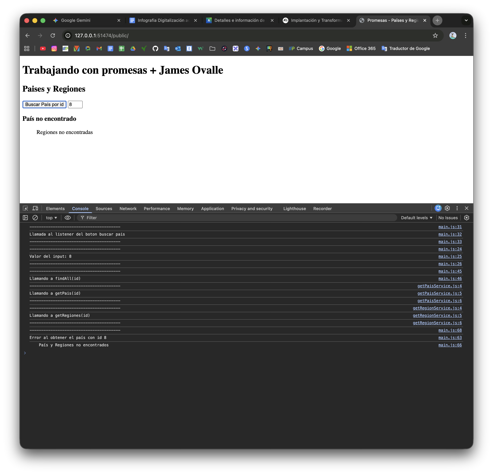

# Manual con capturas de logs

## Branch `feature/ejercicio-uno-promesa-async`

### Ejercicio 1.- Estado `Resolve`

### Ejercicio 1.- Estado `Reject`

## Branch `feature/ejercicio-dos-promesa-then`

### Ejercicio 2.- Estado `Resolve`

### Ejercicio 2.- Estado `Reject`

## Branch `feature/ejercicio-tres-paralelo`

### Ejercicio 3.- Estado `Resolve`

### Ejercicio 3.- Estado `Reject`

